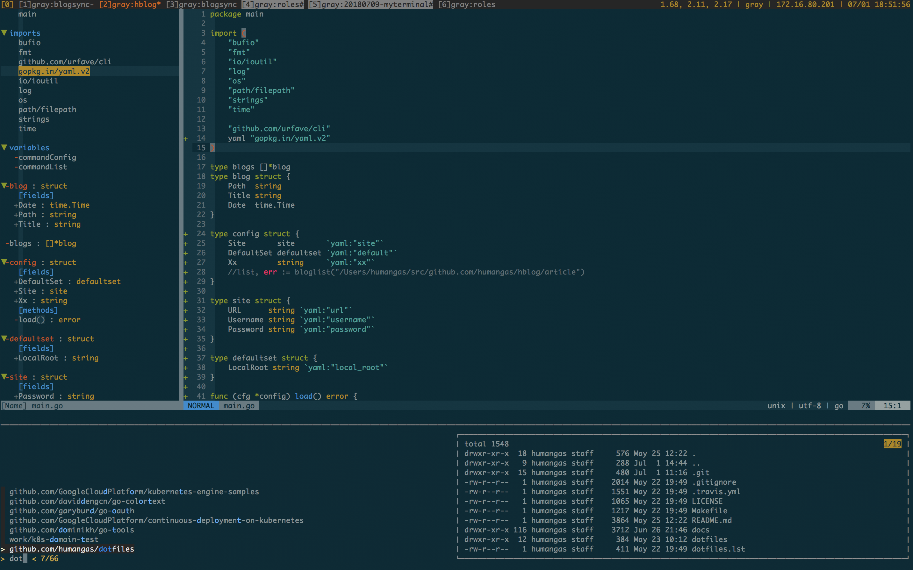
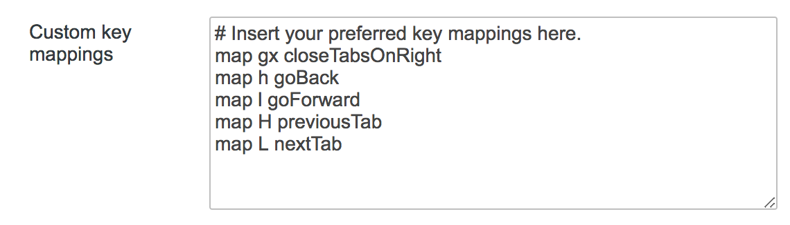
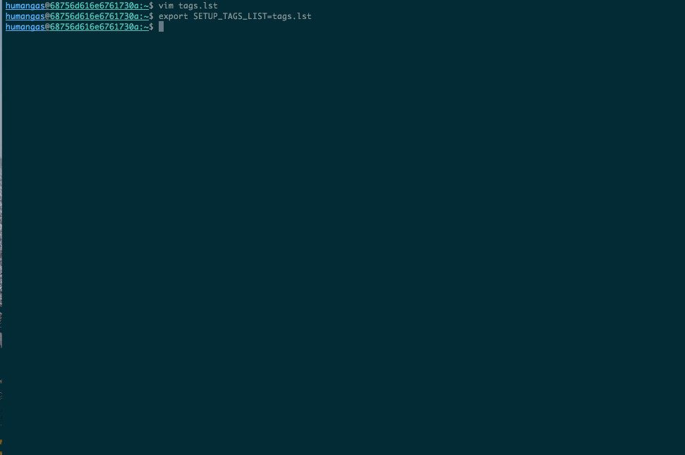
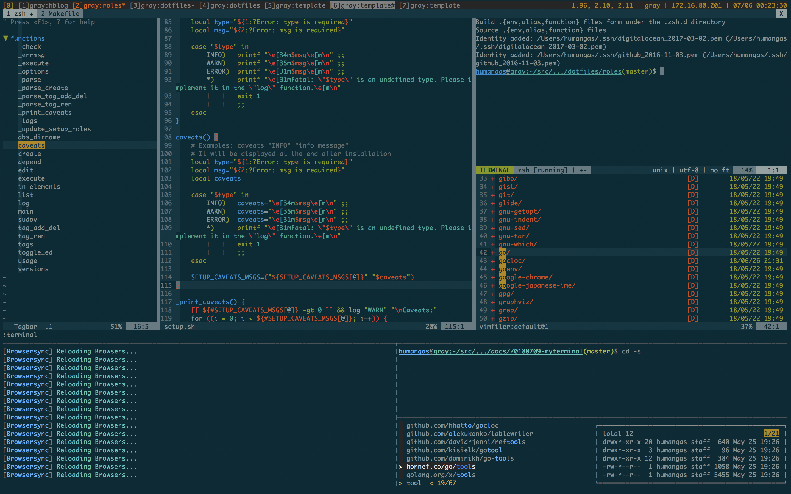
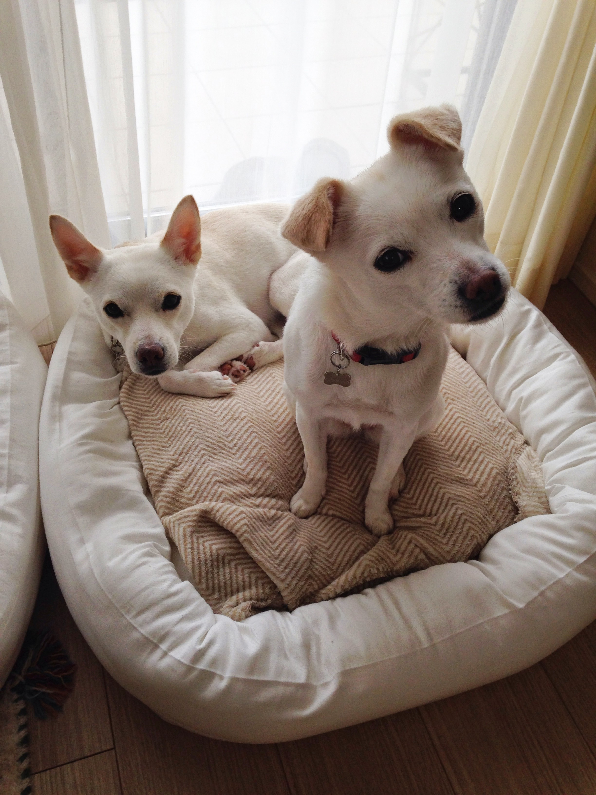

title: my terminal
class: animation-fade
layout: true

<!-- This slide will serve as the base layout for all your slides -->
.bottom-bar[
  {{title}}
]

---

background-image: url(title.png)
class: impact


---

# $whoami

.center[
  
  ### shigehisam
]

--
.center[
  ### オッサン（犬好き）
]


---

# 話すこと
自己紹介がてらに、  
仕事道具であるターミナルのこだわりについて紹介します。

<br>
結局、個人の好みの世界ではありますが、  
どのレイヤのエンジニアでも共通して使うツールだと思うので、  
何か一つでも「おっ」と興味を引くものがあれば幸いです。


---

# 基本スタイル
### 私のターミナル操作で欠かせない基本セットです（定番）

.col-6[
- shell: zsh
- マルチプレクサ: tmux
- エディタ: vim
- フィルタリング: fzf
- ソース管理: $GOPATH + ghq
- カラースキーマ: Solarized
]

.col-6[

]


---

# 作業別操作
### 先程の基本セット + α でこれらの操作をひたすらデモります

.col-6[
- 何かを探す
- Git 操作
- メモをとる
- 一時的な作業をする
]
.col-6[
- いつでも vim りたい
- セットアップ
- ショートカット
- カラースキーマ: Solarized
]


---

# 何かを探す 
### 何か = ファイル、ファイル内、履歴（cd, コマンド）

- ソースは [$GOPATH](https://github.com/golang/go/wiki/GOPATH) + [ghq](https://github.com/motemen/ghq) で場所を決めると探しやすい
- それに [fzf](https://github.com/junegunn/fzf) を組み合わせる
- それを、自作コマンド化して自分に合うようにする
- さらに、[vim](https://github.com/junegunn/fzf.vim) でもだいたい同じことができるようにする


---

## 自作コマンド: [cdex](https://github.com/humangas/dotfiles/blob/master/roles/zsh/.zsh.d/zsh.function.cdex.sh)

.small[
```terminal
$ cd --help
Usage: cd [options] [dir]

options:
  -s, --src           List $GOPATH/src list
  -w, --work          List $GOPATH/src/work/*/ list
  -g, --git           Open git url
  --                  List history
  **                  Subsequently press tab, fzf mode will be set

```
]

---

## 自作コマンド: [fgo](https://github.com/humangas/fgopen)

.small[
```terminal
$ fgo --help
Usage: fgo [--version] [--help] [options] [path]
Version: 0.4.0

Options:
    --grep, -g       grep mode
    --batch, -b      batch mode

Keybind:
    ctrl+u           Page half Up
    ctrl+d           Page half Down
    ctrl+f           Switch grep mode and file selection mode
    ctrl+i, TAB      Select multiple files. Press ctrl+i or shift+TAB to deselect it
    ctrl+a           Select all
    ctrl+q, ESC      Leave processing

```
]


---

## Demo

1. `ghq get <username>/<repository>`: = git clone
1. `cd -s`: リポジトリを探して、選んで、移動
1. `cd **`, `vim **`, `cd --`, `crl+r`: 移動, 開く, cd履歴, コマンド履歴
1. `fgo`: ファイルを開く
1. `fgo -g`: Grepしてファイルで開く
1. `vim > junegunn/fzf.vim > FzfBLines`: ファイル内でGrep
1. `vim > junegunn/fzf.vim > FzfAg`: カレントディレクトリのファイルをGrep 


---

# Git 操作
### Git操作を楽に行う

- tig: Text-mode interface for git 
- vim plugin > airblade/vim-gitgutter: git diff をソース内に表示
- zsh prompt: .small[`PROMPT="%U%F{blue}%n%f@%F{cyan}%m:%(5~,%-2~/.../%2~,%~)%f%u"`]
- hub: .small[`function git(){hub "$@"}`]


---

## Demo

1. リポジトリに移動: prompt でブランチとその状態が分かる
1. ソース編集する: vim plugin で変更点がリアルタイムに分かる
1. tig でコミットしやすく（.tigrcでそのままpush, ファイル単位のgit log参照）
1. hub alias git でGitHub操作がgitコマンドで（issue表示,PR,リポ作成, ブラウズ)


---

# メモをとる
### どこでもメモ、コマンドでも、vimでも

- コマンドでメモ: note（自作）
- vimでメモ: vim plugin > glidenote/memolist.vim
- MarkdownをPreview: vim plugin > PrevimOpen, Typora


---

## 自作コマンド: [note](https://github.com/humangas/note)

.small[
```terminal
$ note
Usage: note [--version] <command> [<args>]
Version: 0.3.0

Command:
    new,n <title>           Create note
    list,l [--full-path]    List note
    edit,e [filter]         Edit note
    grep,g [filter]         Grep note
    finder,f                Open finder

Customize:
    export NOTE_POST_DIR="~/note"
    .....
```
]


---

## Demo

1. `note n`: 新規メモ作成
1. `note l`: メモリスト, `note g`: メモをGrep, `note e`: 既存メモ編集
1. `vim plugin > glidenote/memolist.vim`: vimでも同じような操作を
1. `vim plugin > PrevimOpen, Typora`: vim から Preview 表示


---

# 一時的な作業をする
### すぐに作業をできるようにする。後で探しやすくする。

- ソース同様、[$GOPATH](https://github.com/golang/go/wiki/GOPATH) スタイルで作業場所つくる: mkdir 独自拡張
- 作業場所だけ探す: cd 独自拡張


---

## 自作コマンド: [mkdirex](https://github.com/humangas/dotfiles/blob/master/roles/zsh/.zsh.d/zsh.function.mkdirex.sh)

.small[
```terminal
$ mkdir --help
Usage: /usr/local/opt/coreutils/libexec/gnubin/mkdir [OPTION]... DIRECTORY...
Create the DIRECTORY(ies), if they do not already exist.

Mandatory arguments to long options are mandatory for short options too.
  -w  DIRNAME   　  creating DIRNAME directory under $GOPATH/src/work/ and move it.
  -m, --mode=MODE   set file mode (as in chmod), not a=rwx - umask
  -p, --parents     no error if existing, make parent directories as needed
  -v, --verbose     print a message for each created directory
  -Z                   set SELinux security context of each created directory
                         to the default type
    .....
```
]


--

.small[
```terminal
  -w  DIRNAME   　  creating DIRNAME directory under $GOPATH/src/work/ and move it.
```
]


---

## Demo

1. `mkdir -w`: 作業ディレクトリを作成し移動
1. `cd -w`: 作業ディレクトリに絞って探す


---

# いつでも vim りたい
### 同じ操作で色々やりたい   

- zsh設定: bindkey -v (vi keybind)
- tmux設定: set-window-option -g mode-keys vi (vi keybind)
- chrome設定: Vimium & Custom key mappings
- [hammerspoon](https://github.com/dbmrq/dotfiles/blob/master/home/.hammerspoon/vim.lua): アプリ単位で vim キーバインド設定できたり


---

## Demo

1. zsh: 長いコマンドをvim 操作で修正して実行
1. tmux: visual モードでコピペ 
1. chrome > Vimium: 基本操作, 拡張操作

.right[
  
]


---

# [セットアップ](https://github.com/humangas/dotfiles)
### どこでも同じ環境にしたい

- いちいち手で設定していられない（憶えられない）
- ツールが増えたり減ったりするのでちゃんと管理したい
- なので、dotfiles
- でも、ターミナルだけでなく丸ごと復元したい
- 結局、自分がやりたいことができるコマンドを自作（昔Ansible）


---

## Demo

1. ワンライナーでインストール: .small[`$ curl -sL https://hoge/install | bash`]
1. インストール後の管理: .small[`setup list, version, tags`]
1. インストール後の管理: .small[`setup install, upgrade, config`]
1. [最後にドキュメント化する](https://humangas.github.io/dotfiles/)

.right[
  
]


---

# ショートカット
### ショートカットキーでターミナルに戻りたい

- 基本的に、ターミナル、ブラウザ間を移動しているだけ
- hammerspoon: このアプリ間の移動をキー操作だけでする


---

## Demo

1. キーでターミナル、ブラウザ、その他に移動

### [hammerspoon](https://github.com/humangas/dotfiles/tree/master/dotfiles/.hammerspoon)

.small[
```terminal
・・・

-- keymap: Console > hs.inspect(hs.keycodes.map)
-- semi colon = 41
hs.hotkey.bind(cmd_shift, 41, function() toggle_application("Terminal") end)
-- dot = 47 
hs.hotkey.bind(cmd_shift, 47, function() toggle_application("Google Chrome") end)
-- comma = 43 
hs.hotkey.bind(cmd_shift, 43, function() toggle_application("Typora") end)

・・・
```
]


---

# カラースキーマ: [Solarized](http://ethanschoonover.com/solarized)
## 全てのツールを同じカラースキーマに統一

.col-6[
- zsh:
  - .small[[seebi/dircolors-solarized](https://github.com/humangas/dotfiles/blob/178960988e6e7f7ae2396689b5966e9bdff3b71f/dotfiles/.zshrc#L46)]
- tmux:
  - .small[[seebi/tmux-colors-solarized](https://github.com/humangas/dotfiles/blob/178960988e6e7f7ae2396689b5966e9bdff3b71f/dotfiles/.tmux.conf#L37)]
- fzf:
  - .small[[junegunn/fzf/wiki/Color-schemes#alternate-solarized-lightdark-theme](https://github.com/humangas/dotfiles/blob/ac958a26bdc5dcdfd22b3fca0d19e15ab617dbb3/dotfiles/.zsh.d/fzf.function.sh#L23)]
]
.col-6[
- terminal:
  - .small[[tomislav/osx-terminal.app-colors-solarized](https://github.com/humangas/dotfiles/blob/5d1e9d6cf01b8985b46d3441315e41dba71d4d1a/roles/macos-terminal/setup.sh#L31)]
- vim:
  - .small[[altercation/vim-colors-solarized](https://github.com/humangas/dotfiles/blob/178960988e6e7f7ae2396689b5966e9bdff3b71f/dotfiles/.vimrc#L78)]
  - .small[[set background=dark](https://github.com/humangas/dotfiles/blob/178960988e6e7f7ae2396689b5966e9bdff3b71f/dotfiles/.vimrc#L121)]
  - .small[[itchyny/lightline.vim: let g:lightline.colorscheme](https://github.com/humangas/dotfiles/blob/178960988e6e7f7ae2396689b5966e9bdff3b71f/dotfiles/.vimrc#L126)]
  - .small[[altercation/vim-colors-solarized: g:solarized_termtrans](https://github.com/humangas/dotfiles/blob/178960988e6e7f7ae2396689b5966e9bdff3b71f/dotfiles/.vimrc#L129)]
]


---

class: impact

.center[
  
]

---

.center[
  # Thank you
  
]

